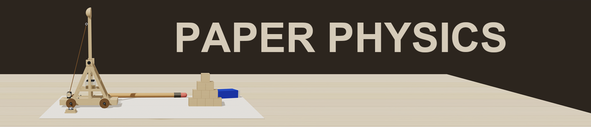

# paper-physics



手绘一张草图，生成一个可交互的 3D 物理模型。

## 已完成案例

| 案例 | 物理特性 |
|---|---|
| **投石机** | 4:1 杠杆配重驱动，cannon-es 刚体物理，参数化配重/球重/拉角，积木击倒 |
| **牛顿摆** | V 绳双摆约束，质量加权弹性碰撞，钢/塑材质切换（密度表），双向对撞实验 |

## 工作流

提交图纸 → 回答 3 个确认门（需求/Mesh清单/交互节点）→ 自动构建 → 验收。
全程无需用户写代码或测试。

## 核心原则

- **Spec 是契约**：草图、3D、物理都从同一份规格生成
- **物理来自刚体，不是手写公式**：改臂长，结果跟着变
- **可行性先于 UI**：跑不通的设计几分钟就毙掉
- **声明什么没建模**：刚体不覆盖强度/疲劳/流体，如实说明
- **灯光/桌面/面板标准化**：所有案例共用同一套视觉基线

## 本地运行

### 预览构建版（日常看效果）

```bash
git clone https://github.com/recohcity/paper-physics.git
cd paper-physics
npx vite
```

打开 http://localhost:5175/ 进入大厅，点击图纸进入各案例。

### 开发模式（改代码热更新）

```bash
./dev.sh
```

启动三个 dev server：投石机 5173、牛顿摆 5174、大厅 5175。
大厅会自动跳转到对应的 dev server，支持热更新。

## 项目结构

```
cases/
├── lobby/          # 大厅入口（可拖拽图纸卡片进入各案例）
├── trebuchet/      # 投石机
└── newton-cradle/  # 牛顿摆
skill/
└── sketch2sim/     # 可复用模板 + 规范（12步工作流、44条pitfalls、视觉标准、门禁脚本）
```

## License

MIT
