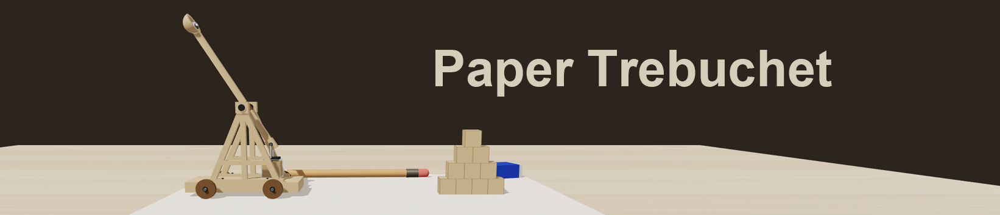

<div align="center">



# Paper Trebuchet — Sketch to Physics

**An interactive 3D trebuchet simulation that grows from a hand-drawn blueprint into a real-time rigid-body physics model.**

[English](#english) · [中文](#中文)

</div>

---

## English

### Overview

Paper Trebuchet is a demonstration-grade interactive 3D simulation that reproduces the full journey from a
pencil sketch on engineering paper to a physically simulated balsa-wood trebuchet with gravitational
drive, hinged-lever dynamics, and a collapsible 10-block target pyramid. It is also the worked example of
the [`skill/sketch2sim`](./skill/sketch2sim/SKILL.md) project: every physical quantity in the demo carries
provenance, and the mechanism design was validated by a Lagrangian reference solver cross-checked against
the in-browser physics engine before the UI was built.

### Highlights

- **Sketch → 3D morph** — a 4-stage transition (blueprint → lifted 2D cutouts → white model → textured
  balsa model) with a slideable morph control and hand-drawn-style annotations on a 2D canvas overlay.
- **Real hinge dynamics, no fitted formulas** — the throwing arm and the hanging counterweight are two
  Cannon-es rigid bodies joined by `HingeConstraint`s and driven purely by gravity. Launch speed and angle
  are read from the physics state (`v = ω × r`), so changing an arm length, mass or pin position actually
  changes the result.
- **Feasible, cross-validated mechanism** — per the sketch2sim audit fix plan A: counterweight pin moved to
  0.30 m, 1 scene unit = 1 m as the single scale anchor, and the rig cross-validated between the reference
  solver and Cannon-es within ~1% on speed and ~3% on angle (5/5 variants).
- **Hovering counterweight** — the counterweight box hangs on its hanger rod 20 mm above the deck at rest
  (no deck impact, natural swing decay after a shot).
- **8-step guided tour** — blueprint → outline lift → white model → wood material → **parts annotations**
  (7 components with real-mesh anchors and collision-free curved leaders) → drag-to-fire demonstration →
  slow-motion full replay → **build it yourself**. The scrubber lets you jump to any step, and clicking a
  step plays only that step then pauses.
- **Scene props are physical** — the pencil and the blue-and-white eraser have real static colliders: the
  ball and blocks collide with them instead of passing through.
- **Dual mode** — *Play the tour* (narrative playback) and *Build it yourself* (full control panel:
  counterweight 1.40–3.00 kg, ball 0.30–0.60 kg sized to the cup bore, pull angle 0–84.5°, slow motion,
  Hero/Side/Top views, live SPEED / POWER / RANGE / DOWN readouts in SI units).

### Physics specification (v0.0.3)

| Parameter | Value | Notes |
|---|---|---|
| Scale anchor | 1 scene unit = 1 m | gravity, masses, density, display all derive from it |
| Arm extent | x ∈ [−0.596, 0.315] m | short arm (pin) at 0.30 m |
| Counterweight hanger | pin at 0.30, hang 0.10 m | hovering, 20 mm above deck at rest |
| Counterweight | 1.40 – 3.00 kg (default 2.60) | sand fill follows the slider (full = 3.0 kg) |
| Ball | 0.30 – 0.60 kg (default 0.45) | diameter = 60% → 80% of the 100 mm cup bore |
| Blocks | 0.11³ m, 0.30 kg each | wood–wood friction 0.35, damped |
| Release angle | ~31° (−1.00 rad stop) | geometry-derived, identical every shot |
| Launch (default) | 3.25 m/s, down ≈ 3/10 in-browser | reference solver 3.30 m/s (cross-check < 3%) |
| Tour | 8 steps | parts annotations, drag demo, 0.25× replay, BUILD end state |

### Tech stack

- [Three.js](https://threejs.org/) (r160) — 3D rendering
- [Cannon-es](https://pmndrs.github.io/cannon-es/) (v0.20.0) — rigid-body physics
- [@tweenjs/tween.js](https://github.com/tweenjs/tween.js) — animation easing
- [canvas-confetti](https://www.kirilv.com/canvas-confetti/) — particle effects
- [Vite](https://vitejs.dev/) — build tool

### Getting started

```bash
npm install
npm run dev        # local dev server (default http://localhost:5173)
npm run build      # production build → dist/
npm run preview    # preview the production build
```

Requires Node.js ≥ 18.

### Project structure

```text
paper-trebuchet/
├── index.html            # page shell + control panels
├── package.json
├── dist/                 # production build
└── src/
    ├── spec.js           # single source of truth (MECH physics / GEOM 3D / UI sliders)
    ├── main.js           # app entry, tour controller, drag interaction, UI
    ├── trebuchet.js      # parameterized 3D trebuchet model
    ├── physics.js        # Cannon-es world, hinged mechanism, ball, blocks, prop colliders
    ├── environment.js    # desk, paper, pencil & eraser props
    ├── textures.js       # procedural textures (wood, paper, blueprint)
    ├── annotations.js    # 2D canvas overlay (flight path, part labels, drag hints)
    ├── audio.js          # Web Audio sound effects
    └── style.css
```

### Controls

| Action | Description |
|---|---|
| Drag the cup | hold and pull down to cock, release to fire |
| View | mouse drag to orbit; scroll or zoom slider to zoom; Hero / Side / Top presets |
| WEIGHT / BALL | counterweight and ball mass sliders (mechanism rebuilds live) |
| THROW | fine pull-angle adjustment (0° – 84.5°) |
| Slow motion | 0.25× replay |
| Tour | Play the tour / scrubber / Build it yourself |

### Skill feedback loop

The build is the instance project of [`skill/sketch2sim`](./skill/sketch2sim/SKILL.md): the audit history
(V2–V5), the architecture checklist and the 17 physics pitfalls all live there, and every round of this
demo's fixes has been folded back into the skill's checklist. See
[`skill/sketch2sim/audit/paper-trebuchet-audit.md`](./skill/sketch2sim/audit/paper-trebuchet-audit.md).

---

## 中文

### 项目简介

纸上投石机（Paper Trebuchet）是一个演示级的交互式 3D 仿真项目：从工程纸上的铅笔素描开始，无缝演变为
带重力驱动、真实铰链动力学与可碰撞倒塌金字塔目标的巴尔萨木投石机 3D 模型。它同时也是
[`skill/sketch2sim`](./skill/sketch2sim/SKILL.md) 的实例项目——每个物理量都有来源标注，机构可行性在
搭建 UI 之前就已通过拉格朗日参考解算器与浏览器物理引擎的交叉验证。

### 核心特性

- **草图 → 3D 渐变**：四阶段过渡（图纸 → 2D 纸片立起 → 白模 → 木纹材质），滑块自由控制形态，
  2D 画布叠加手绘风格标注。
- **真实铰链动力学（无拟合公式）**：投石臂与悬垂配重是两个 Cannon-es 刚体，由两个
  `HingeConstraint` 铰链连接、纯重力驱动；出射速度与仰角从物理状态实时读出（v = ω × r），
  改动臂长 / 质量 / 销轴位置会真实改变结果。
- **可行机构（已交叉验证）**：按 sketch2sim 审计方案 A——配重销轴移至 0.30 m、统一尺度锚点
  （1 单位 = 1 m）；解算器与 Cannon-es 速度差 <1%、角度差 <3%（5/5 变体通过）。
- **配重箱悬停**：静止时吊于挂杆、盒底离甲板 20 mm，发射后自然摆动衰减，不撞击甲板。
- **8 步引导 tour**：图纸 → 轮廓立起 → 白模 → 材质 → **部件标注**（7 个部件、锚点取真实
  mesh 世界坐标、曲线引线防重叠）→ 拖拽发射示意 → 慢镜完整回放 → **build it yourself**；
  滑条可跳任意步骤，点热点只播放该步骤后暂停。
- **道具真实物理**：铅笔与蓝白橡皮擦带真实静态碰撞体，球与方块不再穿透。
- **双模式**：*Play the tour*（叙事播放）与 *Build it yourself*（自由调校面板：
  配重 1.40–3.00 kg、球 0.30–0.60 kg 按碗内径比例、拉角 0–84.5°、慢动作、Hero/Side/Top 视角、
  SPEED / POWER / RANGE / DOWN 实时读数，统一米制）。

### 物理规格（v0.0.3）

| 参数 | 数值 | 说明 |
|---|---|---|
| 尺度锚点 | 1 场景单位 = 1 m | 重力 / 质量 / 密度 / 显示单位统一推导 |
| 臂范围 | x ∈ [−0.596, 0.315] m | 短臂（销轴）0.30 m |
| 配重吊挂 | 销轴 0.30、悬吊 0.10 m | 悬停，静止离甲板 20 mm |
| 配重 | 1.40 – 3.00 kg（默认 2.60） | 透明箱沙量随滑块联动（满箱 = 3.0 kg） |
| 球 | 0.30 – 0.60 kg（默认 0.45） | 直径 = 碗内径 100 mm 的 60% → 80% |
| 方块 | 0.11³ m、0.30 kg/块 | 木-木摩擦 0.35，带阻尼 |
| 释放角 | ~31°（停止位 −1.00 rad） | 几何决定，每次发射相同 |
| 默认发射 | 浏览器实测 3.25 m/s、down≈3/10 | 解算器 3.30 m/s（交叉验证 <3%） |
| Tour | 8 步 | 部件标注、拖拽示意、0.25× 回放、BUILD 终态 |

### 技术栈

- [Three.js](https://threejs.org/) (r160) — 3D 渲染
- [Cannon-es](https://pmndrs.github.io/cannon-es/) (v0.20.0) — 刚体物理
- [@tweenjs/tween.js](https://github.com/tweenjs/tween.js) — 动画缓动
- [canvas-confetti](https://www.kirilv.com/canvas-confetti/) — 粒子特效
- [Vite](https://vitejs.dev/) — 构建工具

### 快速上手

```bash
npm install
npm run dev        # 本地开发（默认 http://localhost:5173）
npm run build      # 生产构建 → dist/
npm run preview    # 预览生产构建
```

需要 Node.js ≥ 18。

### 项目结构

```text
paper-trebuchet/
├── index.html            # 页面骨架与控制面板
├── package.json
├── dist/                 # 生产构建产物
└── src/
    ├── spec.js           # 运行时单一数据源（MECH 物理 / GEOM 3D / UI 滑块）
    ├── main.js           # 应用入口、tour 控制器、拖拽交互、UI
    ├── trebuchet.js      # 参数化投石机 3D 模型
    ├── physics.js        # Cannon-es 物理世界、铰链机构、球、方块、道具碰撞体
    ├── environment.js    # 书桌、纸、铅笔与橡皮擦道具
    ├── textures.js       # 程序化纹理（木纹、纸、蓝图）
    ├── annotations.js    # 2D 画布叠加层（飞行轨迹、部件标注、拖拽示意）
    ├── audio.js          # Web Audio 音效
    └── style.css
```

### 操作指引

| 操作 | 说明 |
|---|---|
| 拖拽碗 | 按住下拉蓄力，松开发射 |
| 视角 | 鼠标拖拽环绕；滚轮 / 缩放滑块；Hero / Side / Top 预设 |
| WEIGHT / BALL | 配重与球质量滑块（机构实时重建） |
| THROW | 拉角微调（0° – 84.5°） |
| 慢动作 | 0.25× 慢镜回放 |
| Tour | Play the tour / 滑条跳步 / Build it yourself |

### skill 反哺闭环

本项目是 [`skill/sketch2sim`](./skill/sketch2sim/SKILL.md) 的实例项目：审计记录（V2–V5）、架构检查清单与
17 条物理陷阱全部沉淀在 skill 中，本 demo 每一轮修复都反哺回 skill 的检查清单。详见
[`skill/sketch2sim/audit/paper-trebuchet-audit.md`](./skill/sketch2sim/audit/paper-trebuchet-audit.md)。
