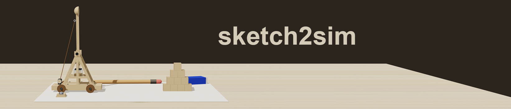

# sketch2sim — 草图转物理仿真



手绘一张草图，几秒后变成一个可交互的 3D 物理 demo。

## 它是什么

sketch2sim 是一个从草图到仿真的自动化工作流。你只需要：

1. 画一张机构草图（牛顿摆、投石机、机械臂…）
2. 上传图片
3. 等待 —— 你会得到一个完整的可运行项目：
   - **SKETCH**：草图平铺在 A4 纸上
   - **LIFT**：2D 草图立起成 3D
   - **MODEL**：白模拉宽成形
   - **MATERIAL**：材质恢复
   - **INTERACTION**：真实物理让模型动起来

## 为什么做

大多数物理仿真工具要么要专业 CAD 软件，要么要写大量代码。sketch2sim 把这条路压缩成：**画 → 跑 → 玩**。

适合：
- 学生做物理课作业 / 课题验证
- 发明者快速验证机构想法
- 老师做交互式教学素材
- 任何人有个"小发明"想法想先跑跑看

## 核心原则

- **Spec 是契约**：草图、3D、物理都从同一份规格生成
- **物理来自刚体，不是手写公式**：改臂长，结果跟着变
- **可行性先于 UI**：跑不通的设计几分钟就毙掉
- **声明什么没建模**：刚体不覆盖强度/疲劳/流体，如实说明

## 在线体验

大厅：[paper-trebuchet.vercel.app](https://paper-trebuchet.vercel.app)

## 本地运行

```bash
git clone https://github.com/recohcity/paper-trebuchet.git
cd paper-trebuchet
./dev.sh
```

打开 http://localhost:5175/ 进入大厅。

## 项目结构

```
cases/
├── trebuchet/      # 投石机
├── newton-cradle/  # 牛顿摆
└── lobby/          # 大厅入口
skill/
└── sketch2sim/     # 可复用模板 + 规范
```

## License

MIT
